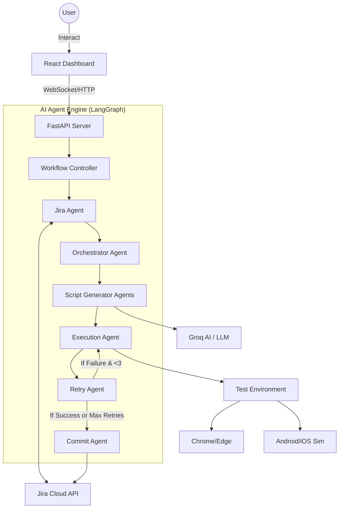

# Test Agent: AI-Powered Automation Project Documentation

## 🚀 One-Line Project Summary
An intelligent AI-driven automation platform that transforms Jira tickets into executable end-to-end test scripts across Web, Android, and iOS.

---

## 💡 Simple Explanation for Layman
Imagine a smart QA engineer that never sleeps. You give it a Jira ticket number, and it automatically reads the requirements, writes the software code needed to test those requirements, runs the test on a real browser or mobile device, and shows you exactly what passed or failed. It "thinks" through problems and even tries to fix the test code itself if it runs into an error.

---

## 🏗️ Architecture Diagram


---

## 🤖 Agent List & Responsibilities

| Agent | Responsibility |
|-------|----------------|
| **Jira Agent** | Connects to Jira, fetches ticket data, and extracts Summary, Description, and Acceptance Criteria. |
| **Orchestrator Agent** | Analyzes the request components (Platform, Language, Framework) to route the task to the correct generator and executor. |
| **Script Generators** | Specialized agents that use AI to write test code. Supported: `Python Playwright`, `Python Selenium`, `Java Selenium`, `Python Appium`. |
| **Execution Agent** | Manages the local environment to run the generated scripts. Supported: `Playwright`, `Selenium`, `Appium`. |
| **Retry Agent** | Analyzes execution failures and increments retry counts. Initiates up to 3 re-execution attempts for failed tests. |
| **Commit Agent** | Formats execution results into a rich Jira table and posts them as comments, along with attaching the generated script file. |

---

## 🛠️ MCP Tools Used
- **`jira_tool`**: Custom Model Context Protocol tool for authenticated Jira operations.
- **`script_writer_tool`**: Manages the creation, versioning, and cleanup of generated test files.
- **`web_search_tool`**: (Optional) Used for researching latest documentation for specific testing libraries.

---

## 🔗 External Connectors
- **Jira Cloud API**: For ticket lifecycle management and context gathering.
- **Groq Cloud API**: Powering the Llama-3 reasoning engine for script generation and error fixing.
- **Playwright/Selenium/Appium**: Core execution engines for browser and mobile drivers.

---

## 💻 Tech Stack
- **Backend**: Python 3.10+, FastAPI (API Framework), LangGraph (Agent Orchestration), Pydantic (Data Validation).
- **Frontend**: React 19, Vite (Build Tool), TailwindCSS 4 (Styling), Framer Motion (Animations).
- **Automation**: Playwright, Selenium, Appium, Pytest, JUnit.

---

## 📦 Package Versions (Key Dependencies)

**Backend (Python)**
- `fastapi`: Latest
- `langgraph`: Latest
- `langchain`: Latest
- `groq`: Latest
- `pydantic`: ^2.0.0
- `appium-python-client`: Latest

**Frontend (Node.js)**
- `react`: ^19.2.0
- `vite`: ^7.3.1
- `tailwindcss`: ^4.2.1
- `lucide-react`: ^0.577.0

---

## 📋 Setup Prerequisites
1. **Python 3.10+**: Installed and added to PATH.
2. **Node.js 18+**: Installed for the frontend dashboard.
3. **API Keys**:
   - `GROQ_API_KEY`: For AI reasoning.
   - `JIRA_API_TOKEN`: For ticket access.
4. **Drivers**: Chrome/Edge drivers (for Selenium) or Appium Server (for Mobile).

---

## 📁 Folder Structure
```text
Test Agent/
├── backend/                # Python FastAPI Backend
│   ├── app/
│   │   ├── agents/         # AI Agent implementations
│   │   ├── graph/          # LangGraph workflow definitions
│   │   ├── mcp_tools/      # Integrated MCP Tools
│   │   └── services/       # AI and External API services
├── frontend/               # React Vite Frontend
│   ├── src/
│   │   ├── components/     # UI Components (Logs, Results, Input)
│   │   └── pages/          # Dashboard Views
├── scripts/                # Generated Test Script Artifacts
├── .env                    # Environment Configuration
└── requirements.txt        # Backend dependencies
```

---

## 🚀 Deployment Steps
1. **Clone the repository** to your local machine.
2. **Backend Setup**:
   - Create a virtual environment: `python -m venv venv`
   - Activate it: `venv\Scripts\activate`
   - Install dependencies: `pip install -r requirements.txt`
   - Start Server: `uvicorn main:app --reload`
3. **Frontend Setup**:
   - Navigate to `/frontend`: `cd frontend`
   - Install dependencies: `npm install`
   - Start Dashboard: `npm run dev`
4. **Access UI**: Open `http://localhost:5173` in your browser.
